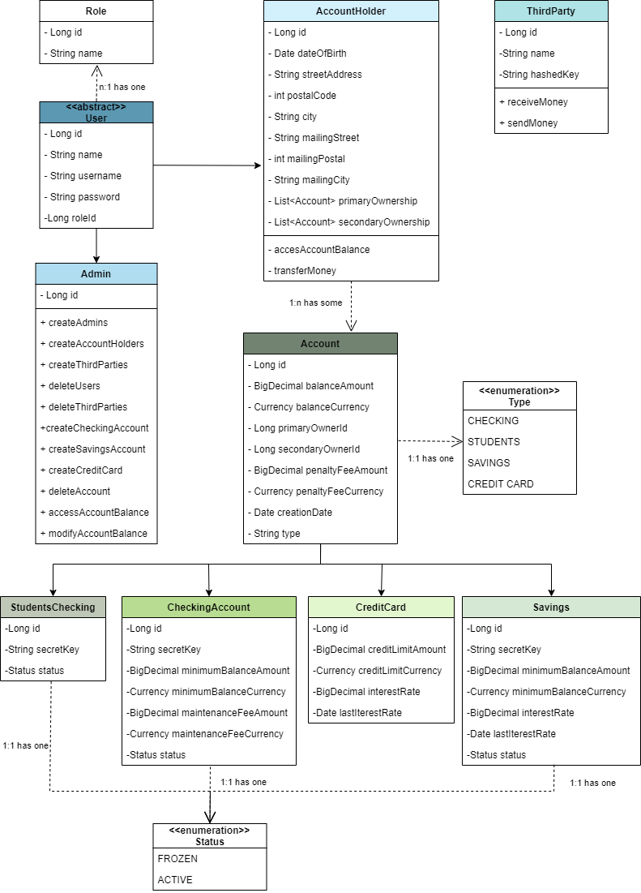
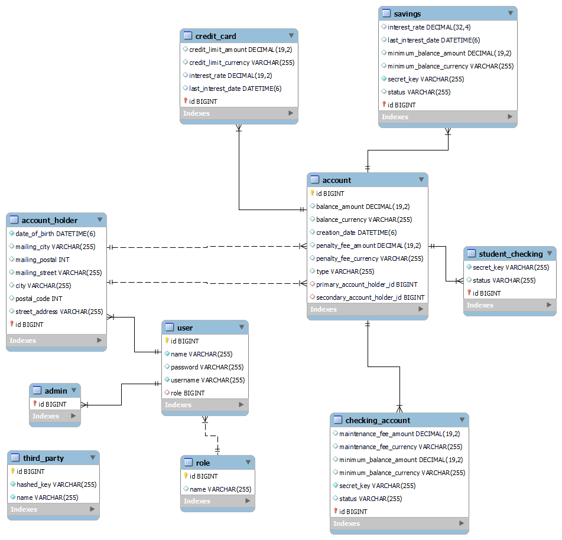

# MIDTERM PROJECT - BANKING SYSTEM

## DESCRIPTION OF THE PROJECT

This project consists of a simple banking system, in which different types of users and accounts are held. 

Users either can be administrators, account-holders or third-parties. Each of them has different functionalities available. Administrators are responsible for creating both any kind of user and account and deleting it later. They can also have access to every part of the database. Account-holders can be primary or secondary owners of as many accounts as they want. They can access their accounts' balance and transfer money from any of their accounts to other accounts in the database. Administrators and account holders need to be authenticated with their username and password to be able to have access to these functionalities. Third-party users don't own any account saved in the database and therefore they don't need a username or password. They're only authorized to send or receive money when some other security requirements are met.

Regarding the accounts, 4 types are available: Checking account, student checking account, savings account and credit card account. Student checking accounts are automatically created if the primary owner chooses to have a checking type account and they're younger than 24. Both checking account and savings account types have a minimum balance that is required to mantain; otherwise a penalty fee will be applied. This condition is checked every time the balance is changed negativelly (transfers both to another account or to a third party and balance modifying by an admin). Savings account and credit card account types have an interest rate that increases the balance of the account annually in the first case and monthly in the second. This condition is checked every time the system runs.

## TECHNOLOGIES USED

The project has been developed using Java 17 Spring Boot. For managing data, the technology chosen has been MySQL. Authentication is handled by Spring Security and for testing both JUnit and MockMVC are used. 

## MODELS

The following diagrams show the structure of the whole project.

*Class diagram*

*MySQL reverse engineer.*

## SERVER ROUTES TABLE

<b>POST /api/login</b>

Used to collect a Token for a registered User. There is no authorization required.

<b>POST /api/users/admins</b>

Used to create new admins. Just a name and unique username are required as the same password is set automatically for each new user created and the role is automatically set to ADMIN. Only authenticated admins can access this endpoint.

<b>POST /api/users/accountHolders</b>

Used to create new account holders. A name, a unique username, a date of birth, a primary address and an optional mailing address are required. The password is set automatically to '123456' for each new user created and the role is automatically set to ACCOUNT_HOLDER. Only authenticated admins can access this endpoint.

<b>POST /api/users/thirdParties</b>

Used to create new third parties. A name and a hashed key are required. Only authenticated admins can access this endpoint.

<b>POST /api/accounts/creditCards</b>

Used to create new credit card type accounts. Balance and a primary account holder id are required. With only this information given, credit limit and interest rate are set to their default values. These values can also be personalised if added whe creating the account and a secondary account holder can be added too indicating its id. Type is always automatically set to CREDIT_CARD, creation date automatically sets to the current date and penalty fee is the same for every account type. Only authenticated admins can access this endpoint.

<b>POST /api/accounts/savings</b>

Used to create new savings type accounts. Balance, a secret key and a primary account holder id are required. With only this information given, minimum balance and interest rate are set to their default values. These values can also be personalised if added when creating the account and a secondary account holder can be added too indicating its id. Type is always automatically set to SAVINGS, status to ACTIVE, creation date automatically sets to the current date and penalty fee is the same for every account type. Only authenticated admins can access this endpoint.

<b>POST /api/accounts/checkingAccounts</b>

Used to create new checking type accounts. Balance, a secret key and a primary account holder id are required. Depending the account holders age, either a students checking account or a checking account will be created. If a checking account is created, the minimum balance and maintenance fee are set to their default values. A secondary account holder can be added in both cases indicating its id. Type is always automatically set to either CHECKING or STUDENT_CHECKING, status to ACTIVE, creation date automatically sets to the current date and penalty fee is the same for every account type. Only authenticated admins can access this endpoint.

<b>GET /api/accounts/{id}/balance</b>

Used to show an accounts balance by its id. Only authenticated admins can access this endpoint.

<b>GET /api/accounts/{username}</b>

Used to show an account holders accounts. Only authenticated account holders can access this endpoint and each account holder will only see its own accounts.

<b>GET /api/users</b>

Used to show every user saved in the database. Only authenticated admins can access this endpoint.

<b>GET /api/users/{id}</b>

Used to show a users information by its id. Only authenticated admins can access this endpoint.

<b>GET /api/users/thirdParties</b>

Used to show every third party saved in the database. Only authenticated admins can access this endpoint.

<b>PATCH /api/users/{username}</b>

Used to change a users password. New password is just required. Only authenticated users can acces their own endpoint.

<b>PATCH /api/accounts/{id}/balance</b>

Used to modify an accounts balance by its id. New balance is just required. The system checks if the minimum balance keeps being mantained when the account has one to be mantained and if not, the penalty fee is applied. Only authenticated admins can access this endpoint.

<b>PATCH /api/accounts/transfers/{username}/{id}</b>

Used to transfer money between accounts. The account from which the transfer needs to be done is indicated in the path. First of all, the system checks wether if the selected account belongs to the logged user. The information required for the transfer to be completed includes an amount, an owner id and an account id. The system checks if the account has enough funds to be able to transfer the mentioned amount and if the owner mentioned and the account mentioned correspond. If all the conditions are fulfilled, the transfer happens and both accounts' balance update. As last step, the system checks if the minimum balance keeps being mantained in the account that made the transfer when the account has one to be mantained and if not, the penalty fee is applied. Only authenticated account holders can access their own endpoint.

<b>PATCH /api/accounts/sendMoney</b>

Used to send money to an account. An amount, an account id, the accounts secret key and the third party's hashed key are required. The system checks if the account id and the secret key correspond each other and if the hashed key corresponds to any third party saved in the database. If all the conditions are fulfilled, the transfer happens and account's balance updates. There is no authorization required.

<b>PATCH /api/accounts/receiveMoney</b>

Used to receive money from an account. An amount, an account id, the accounts secret key and the third party's hashed key are required. The system checks if the account id and the secret key correspond each other, if the hashed key corresponds to any third party saved in the database and if the account has enough funds to be able to transfer the mentioned amount. If all the conditions are fulfilled, the transfer happens and the account's balance updates. As last step, the system checks if the minimum balance keeps being mantained in the account that made the transfer when the account has one to be mantained and if not, the penalty fee is applied. There is no authorization required.

<b>DELETE /api/users/{id}</b>

Used to delete a user by its id. Only authenticated admins can access this endpoint.

<b>DELETE /api/accounts/{id}</b>

Used to delete an account by its id. Only authenticated admins can access this endpoint.

<b>DELETE /api/users/thirdParties/{id}</b>

Used to delete a third party by its id. Only authenticated admins can access this endpoint.

## FUTURE WORK

In the future, the system could be improved by adding an extra security feature capable of detecting fraud and freezing an account when fraudulent pattern detected.

*A project by Olatz Izagirre.*
